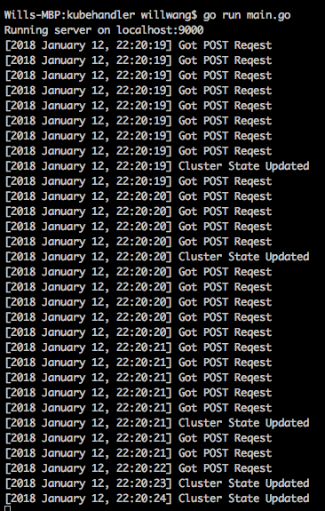

# KubeHandler

Go library that maintains the state of a cluster in kubernetes. 
Records pods, services, and nodes currently running in a cluster along with
which pods belong to which services and which pods reside on which nodes.

Eventually will be used to enforce a set of "rules" on the cluster, such as 
"no machine should have more than 3 pods." Look in pkg/controller/example.go for an 
example of how a rule is to be implemented.

### Running
Integrate with kubewatch. Instead of running `python server.py` in 
www.github.com/hantaowang/kubewatch, run `./kubehandler` here. 

### Building
To modify, make sure you clone this in `$GOWORK/src/github.com/hantaowang/kubehandler`.
You will need the `k8s.io/client-go/...` library installed. Run with `go run main.go` and
build with `go build -o kubehandler main.go`.

### Preview
#### Backend

#### Frontend

